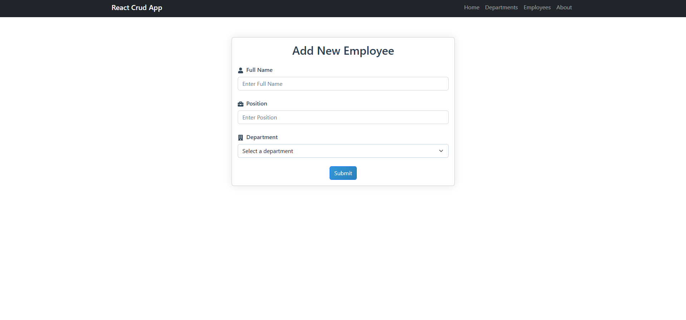

🚀 React CRUD App (Beginner-Friendly Starter Template)

A clean and beginner-friendly React + TypeScript CRUD application built with a flexible and scalable architecture.
This project is perfect for:

Beginners learning React fundamentals

Developers who want a starter template with routing, forms, CRUD, context API

Anyone looking for a clean architecture to build on top of

📌 Key Features

✔️ CRUD Operations (Add, Edit, Delete Employees)

✔️ Clean Component Architecture

✔️ React Router for navigation

✔️ Context API + Custom Hooks

✔️ API Integration using Axios

✔️ Beginner-friendly and easy to extend

✔️ .NET 8 Web API backend

🧰 Tech Stack

Frontend:

React (TypeScript)

React Router

Context API

Axios

CSS Modules

Backend:

.NET 8 Web API

SQL Server

📁 Project Structure
reactjs-crud-app/
│
├── backend/              # .NET Web API
│
└── frontend/
      └── crud-app/
            ├── public/
            │    └── Screenshots/
            ├── src/
            │    ├── components/
            │    ├── hooks/
            │    ├── context/
            │    ├── models/
            │    ├── services/
            │    └── App.tsx
            └── package.json

🖼️ Screenshots (Click to Open)
🏠 Home Page

➕ Add Employee Form

👥 Employee List

⚙️ Running the Project
▶️ 1. Run the Backend (.NET 8 API)

Go to backend folder:

cd backend

Restore dependencies:

dotnet restore

Run the API:

dotnet run

Typically available at:

https://localhost:7282

▶️ 2. Run the Frontend (React App)

Navigate to frontend:

cd frontend/crud-app

Install packages:

npm install

Start the app:

npm start

App runs at:

http://localhost:3000

🎯 Why This App Is a Great Starter Template

This project covers all fundamental concepts needed by React beginners:

🧩 Component-based architecture

🔄 Parent → Child → Parent communication

🧭 React Router navigation

📝 Form handling (controlled components)

🌐 API integration

🧠 Global state using Context API

🔌 Clean separation (hooks, services, models, components)

This makes it an ideal learning resource for anyone starting with React.