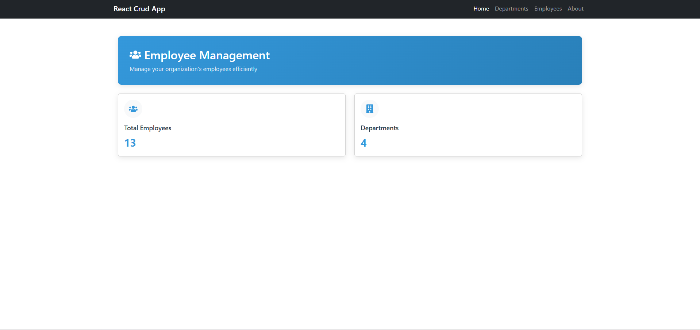

# 🚀 React CRUD App (Beginner-Friendly Starter Template)

A clean and beginner-friendly **React + TypeScript CRUD application**
built with a flexible and scalable architecture.\
This project is perfect for:

-   Beginners learning **React fundamentals**
-   Developers who want a **starter template** with routing, forms,
    CRUD, context API
-   Anyone looking for a clean architecture to build on top of

------------------------------------------------------------------------

## 📌 Key Features

-   ✔️ Create, Read, Update, Delete (Employees)\
-   ✔️ Clean, modular component structure\
-   ✔️ React Router integration\
-   ✔️ Context API + Custom Data Hooks\
-   ✔️ API Integration using Axios\
-   ✔️ Beginner-friendly, easy to extend\
-   ✔️ Backend: .NET 8 Web API

------------------------------------------------------------------------

## 🧰 Tech Stack

**Frontend:**\
React (TypeScript), React Router, Context API, Axios

**Backend:**\
.NET 8 Web API, SQL Server

------------------------------------------------------------------------

# 🖼️ Screenshots (Click to Open)

### 🏠 Home Page



------------------------------------------------------------------------

### ➕ Add Employee Form


------------------------------------------------------------------------

### 👥 Employee List


------------------------------------------------------------------------

# 📂 Project Structure

    reactjs-crud-app/
    │
    ├── backend/              # .NET 8 API
    │
    └── frontend/
          └── crud-app/
                ├── public/
                │    └── Screenshots/
                ├── src/
                │    ├── components/
                │    ├── hooks/
                │    ├── context/
                │    ├── models/
                │    ├── services/
                │    └── App.tsx
                └── package.json

------------------------------------------------------------------------

# ⚙️ Running the Project

## ▶️ 1. Run the Backend (.NET 8 API)

Navigate to backend folder:

``` sh
cd backend
```

Restore dependencies:

``` sh
dotnet restore
```

Run:

``` sh
dotnet run
```

API usually runs at:

    https://localhost:7282

------------------------------------------------------------------------

## ▶️ 2. Run the Frontend (React App)

Navigate:

``` sh
cd frontend/crud-app
```

Install dependencies:

``` sh
npm install
```

Run the app:

``` sh
npm start
```

Runs at:

    http://localhost:3000

------------------------------------------------------------------------

# 🎯 Why This Template Is Great for Beginners

This project covers all core React concepts beginners must learn:

-   🧩 Component-based UI\
-   🔄 Parent → Child → Parent communication\
-   🧭 Navigation using React Router\
-   📝 Controlled Forms\
-   🌐 API integration with Axios\
-   🧠 Context API for global state\
-   📁 Clean, scalable project structure

This makes it a perfect **starter template** for building real-world
apps.

------------------------------------------------------------------------

# 📘 Future Enhancements

-   Toast notifications\
-   Form validation (React Hook Form)\
-   Material UI interface\
-   Pagination & search\
-   Docker support\
-   Unit tests with Jest + RTL

------------------------------------------------------------------------

# ⭐ Support

If this project helped you, please consider giving it a **⭐ star** on
GitHub!
